## Source Image: image-02.png

# The Fastest Fourier Transform in the South 

*Anthony M. Blake, Member, IEEE, Ian H. Witten, Member, IEEE, and Michael J. Cree, Senior Member, IEEE


#### Abstract

This paper describes FFTS, a discrete Fourier transform (DFT) library that achieves state-of-the-art performance using a new cache-oblivious algorithm implemented with runtime specialization. During initialization the transform parameters, such as sign and direction, are fixed, allowing sequencing and data access information to be precomputed and specialized machine code to be generated. The resulting code may be executed any number of times on different input data. In contrast to FFTW, FFTS does not use large base cases at the leaves of recursion, nor a substantial library of codelets, and does not require time-consuming machine-specific calibration. The code presented in this paper has been benchmarked on recent Intel x86 and ARM machines, and is, in almost all cases, faster than selftuning libraries such as FFTW, and even vendor-tuned libraries such as Intel IPP and Apple vDSP.


Index Terms—FFT, Fourier transform, run-time specialization, dynamic code generation

## I. INTRODUCTION

S TATE-OF-THE-ART libraries for computing the discrete Fourier transform (DFT) divide into two categories: vendor-tuned libraries such as Intel Integrated Performance Primitives (IPP) and Apple vDSP, and self-tuning libraries such as FFTW ("The Fastest Fourier Transform in the West"), SPIRAL and UHFFT. The latter are intended as a response to the increasingly difficult problem of reasoning about the interaction between hardware and software; however, self-tuning libraries do not automatically produce good performance on arbitrary machines, and some programming effort is required before they can take advantage of machine-specific features and instructions (such as Altivec on PPC, SSE and AVX on x86, and NEON on ARM).

As well as automatically adapting to the hardware, selftuning libraries are, in effect, applying the technique of program specialization. Instead of providing a single highly parameterized function for computing a range of DFTs, they use an initialization stage to set up a function that operates on one argument, the input data, from a general function of several arguments, such as the size of the input and the direction of the DFT. The idea of program specialization is far from new, and was formulated and proven as Kleene's s-m-n theorem more than 50 years ago [1].

State-of-the-art libraries that are referred to as being 'vendor-tuned' also employ program specialization to some extent. In an initialization stage, trigonometric coefficients

[^0]specific to the size and direction (forward or backwards) of the requested transform are precomputed, and a specialized function can be set up based on the capabilities of the machine and the parameters of the transform.

In Blake's PhD thesis [34], a depth-first recursive implementation of the conjugate-pair algorithm is accelerated by iteratively computing blocks of code found at the leaves of recursion prior to computing the rest of the transform recursively. This work gives a succinct description of that algorithm and describes a more efficient implementation using run-time specialization. The resulting DFT library, called FFTS ("The Fastest Fourier Transform in the South") has been benchmarked on recent Intel x86 and ARM machines, and the measurements show that FFTS is, in almost all cases, faster than state-of-the-art vendor-tuned and self-tuning libraries. Additionally, FFTS manages to do this while avoiding the initialization delay and code-size overheads that plague selftuning libraries.

## II. Related Work

FFTW [2]-[6] and UHFFT [7]-[12] are implementations of the discrete Fourier transform (DFT) that maximize performance by automatically adapting to the hardware at runtime. Given the parameters of a problem, such as size and direction, these libraries employ a planner to search the space of all possible factorizations of several highly parameterized FFT algorithms, and find a plan that has the smallest execution time.

Each plan is composed of blocks of straight-line code, called codelets, which are optimized at a low level. FFTW, for example, has a library of over 150 pregenerated codelets. FFTW and UHFFT compose plans using a wide range of parameterized FFT algorithms, including the Cooley-Tukey algorithm [13] and its derivatives: the split-radix [14], [15], conjugatepair [5], [16] and mixed-radix algorithms. Radar's [17] and Bluestein's [18]-[20] algorithms are used for sizes that are prime, and the prime-factor algorithm [19], [21] for sizes that are factored by co-primes.

Because each plan is divided into subproblems, and because many of the subproblems considered during the search are essentially the same, FFTW and UHFFT apply dynamic programming [22] and evaluate the runtime of each subproblem only once. The first time a given subproblem is evaluated, its runtime is stored, or "memoized", and when the same subproblem is encountered subsequently, the previously measured runtime is retrieved from memory. Dynamic programming does not guarantee that the fastest plan will be found, but it is a good tradeoff between initialization time, where the search for the fastest plan occurs, and execution time [2].

The primary difference between FFTW and UHFFT is that UHFFT initializes two databases of execution times during


[^0]:    *A.M. Blake is with the Department of Computer Science, University of Waikato, Private Bag 3105, Hamilton 3240, NEW ZEALAND e-mail: ablake@waikato.ac.nz phone: +64 78384466 ext 8342 fax: +64 78384155
    I.H. Witten is with the Department of Computer Science, University of Waikato, Private Bag 3105, Hamilton 3240, NEW ZEALAND e-mail: ihw@cs.waikato.ac.nz phone: +64 78384246 fax: +64 78585095
    M.J. Cree is with the School of Engineering, University of Waikato, Private Bag 3105, Hamilton 3240, NEW ZEALAND e-mail: cree@waikato.ac.nz phone: +64 78384301

## Source Image: image-03.png

installation. A codelet database is initialized with the execution times of codelets, and a transform database is initialized with execution times of some popular sizes of FFT (power-of-two and prime-factor algorithm sizes) [10].

In [2], Frigo and Johnson consider those plans that are chosen after searching the space of all possibilities, and conclude that one cannot predict the fastest plan. However, in earlier work they show that some algorithms should in fact have an advantage [24]. In particular, depth-first recursive algorithms have theoretical advantages arising from cache utilization, and these "cache-oblivious" algorithms have been shown to be asymptotically optimal [4], [6], [23], [24].

Kelefouras et al. [25] propose that the performance of an algorithm depends on its utilization of the memory hierarchy, and that it is possible to predict parameter values that will produce the fastest plan based on the characteristics of the underlying machine. However, many of the techniques in their work are specific to scalar microprocessors, and thus the results are not directly applicable to modern machines, which now invariably implement some form of SIMD functionality.

SPIRAL [26]-[31] performs automatic optimization for the Fourier transform and other signal processing functions. However, it differs from FFTW in that it performs the optimization at compile time, and thus the generated code is machinedependent, even if it is compiled on a different machine. Another point of difference is that SPIRAL uses a wider range of search strategies that include ones based on machine learning [32].

In 1977 Morris [33] demonstrated Fortran programs which generate specialized Fortran FFT subroutines. More recently it was shown that static specialization of a cache-oblivious depth-first recursive algorithm can produce results that are, in many cases, faster than vendor-tuned and automatically optimized libraries on a range of modern machines [34]. Metaprogramming was used to statically elaborate a conjugate-pair algorithm with the size and sign of the transform, producing a specialized C program for those particular parameters. The disadvantage of this approach is that either the size and direction of the required transforms must be known at compile time, or a wide range of transforms has to be generated, resulting in a large binary. This paper addresses this limitation by generating specialized machine code at runtime instead.

## III. Conjugate-Pair Algorithm

FFTS uses the conjugate-pair algorithm, or as it sometimes known, the " -1 exponent" algorithm. This is a variant of the standard split-radix algorithm that was initially proposed to reduce the minimum count of floating point operations required to compute the FFT [16], but was later shown to have an operation count identical to that of the ordinary split-radix algorithm [35]-[37]. The algorithm was relegated to obscurity for nearly 20 years, but re-emerged recently when van Buskirk used it as the basis for an algorithm that does actually reduce the operation count [38].

The conjugate-pair algorithm is derived from the DFT,

```
function \(y_{k=0, \ldots, N-1}=\mathrm{FFT}\left(N, x_{n}\right)\)
    if \(N=1\) then
        return \(x_{0}\)
    else if \(N=2\) then
        \(y_{0} \leftarrow x_{0}+x_{1}\)
        \(y_{1} \leftarrow x_{0}-x_{1}\)
        return \(y_{k}\)
    else
        \(U_{k_{2}=0, \ldots, N / 2-1} \leftarrow \mathrm{FFT}\left(N / 2, x_{2 n_{2}}\right)\)
        \(Z_{k_{4}=0, \ldots, N / 4-1} \leftarrow \mathrm{FFT}\left(N / 4, x_{4 n_{4}+1}\right)\)
        \(Z_{k_{4}=0, \ldots, N / 4-1}^{\prime} \leftarrow \mathrm{FFT}\left(N / 4, x_{4 n_{4}-1}\right)\)
        for \(k=0\) to \(N / 4-1\) do
            \(y_{k} \leftarrow U_{k}+\left(\omega_{N}^{k} Z_{k}+\omega_{N}^{-k} Z_{k}^{\prime}\right)\)
            \(y_{k+N / 2} \leftarrow U_{k}-\left(\omega_{N}^{k} Z_{k}+\omega_{N}^{-k} Z_{k}^{\prime}\right)\)
            \(y_{k+N / 4} \leftarrow U_{k+N / 4}-i\left(\omega_{N}^{k} Z_{k}-\omega_{N}^{-k} Z_{k}^{\prime}\right)\)
            \(y_{k+3 N / 4} \leftarrow U_{k+N / 4}+i\left(\omega_{N}^{k} Z_{k}-\omega_{N}^{-k} Z_{k}^{\prime}\right)\)
        end for
        return \(y_{k}\)
    end if
end function
```

Fig. 1. Depth-first recursive algorithm computing conjugate-pair split-radix FFT of length N (divisible by 4).
which is formally defined as [39]:

$$
y_{k}=\sum_{n=0}^{N-1} \omega_{N}^{n k} x_{n}
$$

where $k=0, \ldots, N-1$ and $\omega_{N}$ is the primitive root-of-unity $\exp (-2 \pi i / N)$. A decimation-in-time (DIT) decomposition of the split-radix algorithm divides the DFT in Equation 1 into three smaller DFTs over the terms $x_{2 n_{2}}, x_{4 n_{4}+1}$ and $x_{4 n_{4}+3}$. However, the conjugate-pair algorithm rotates the indices of last sub-transform by -4 , to obtain:

$$
\begin{aligned}
y_{k}= & \sum_{n_{2}=0}^{N / 2-1} \omega_{N / 2}^{n_{2} k} x_{2 n_{2}}+\omega_{N}^{k} \sum_{n_{4}=0}^{N / 4-1} \omega_{N / 4}^{n_{4} k} x_{4 n_{4}+1} \\
& +\omega_{N}^{-k} \sum_{n_{4}=0}^{N / 4-1} \omega_{N / 4}^{n_{4} k} x_{4 n_{4}-1}
\end{aligned}
$$

where $\omega_{N}^{k}$ and $\omega_{N}^{-k}$ are the conjugate-pair of coefficients, and the negative indices wrap around, i.e., $x_{-1}=x_{N-1}$ [5]. The advantage of this arrangement is that only one coefficient needs to be computed or loaded, instead of the two required by the ordinary split-radix algorithm.

Equation 2 becomes a fast Fourier transform when the three DFTs are themselves evaluated recursively with Equation 2, and thus the FFT easily maps to a depth-first recursive algorithm, as shown in Figure 1. Such an implementation makes optimal use of the memory hierarchy while being oblivious of its parameters, because when the sub-transforms of size $N / 2$ and $N / 4$ are combined into a larger transform of size $N$, they will still be in the closest level of the memory hierarchy in which they fit [24].

Although the FFT naturally maps quite well to a recursive implementation, most traditional implementations found in

## Source Image: image-04.png

```
procedure FFT-NOLEAVES \(\left(N, y_{k=0, \ldots, N-1}\right)\)
    if \(N>2\) then
        FFT-NOLEAVES \(\left(N / 2, y_{N_{2}}\right)\)
        FFT-NOLEAVES \(\left(N / 4, y_{N_{4}+N / 2}\right)\)
        FFT-NOLEAVES \(\left(N / 4, y_{N_{4}+3 N / 4}\right)\)
        \(U_{k_{2}=0, \ldots, N / 2-1} \leftarrow y_{N_{2}}\)
        \(Z_{k_{4}=0, \ldots, N / 4-1} \leftarrow y_{N_{4}+N / 2}\)
        \(Z_{k_{4}=0, \ldots, N / 4-1}^{\prime} \leftarrow y_{N_{4}+3 N / 4}\)
        for \(k=0\) to \(N / 4-1\) do
            \(y_{k} \leftarrow U_{k}+\left(\omega_{N}^{k} Z_{k}+\omega_{N}^{-k} Z_{k}^{\prime}\right)\)
            \(y_{k+N / 2} \leftarrow U_{k}-\left(\omega_{N}^{k} Z_{k}+\omega_{N}^{-k} Z_{k}^{\prime}\right)\)
            \(y_{k+N / 4} \leftarrow U_{k+N / 4}-i\left(\omega_{N}^{k} Z_{k}-\omega_{N}^{-k} Z_{k}^{\prime}\right)\)
            \(y_{k+3 N / 4} \leftarrow U_{k+N / 4}+i\left(\omega_{N}^{k} Z_{k}-\omega_{N}^{-k} Z_{k}^{\prime}\right)\)
        end for
    end if
end procedure
procedure FFT-SOUTH \(\left(x_{n=0, \ldots, N-1}, y_{k=0, \ldots, N-1}\right)\)
    \(j \leftarrow 0\)
    for \(k=0\) to \(N / N_{l} / 3\) do
        \(y_{\delta_{j}} \leftarrow x_{j}+x_{j+N / 2}\)
        \(y_{\delta_{j}+1} \leftarrow x_{j}-x_{j+N / 2}\)
        \(j \leftarrow j+1\)
    end for
    for \(k=0\) to \(N / N_{l} / 3+\left(\log _{2} N\right.\) and \(1 \mathrm{xor} 1\right)-1\) do
        \(y_{\delta_{j}} \leftarrow x_{j}\)
        \(y_{\delta_{j}+1} \leftarrow x_{j+N / 2}\)
        \(j \leftarrow j+1\)
    end for
    for \(k=0\) to \(N / N_{l} / 3-1\) do
        \(y_{\delta_{j}} \leftarrow x_{j+N / 2}+x_{j}\)
        \(y_{\delta_{j}+1} \leftarrow x_{j+N / 2}-x_{j}\)
        \(j \leftarrow j+1\)
    end for
    FFT-NOLEAVES \(\left(N, y_{k}\right)\)
end procedure
```

Fig. 2. FFT-SOUTH first computes the base cases iteratively, by order of access to the input array, in the three loops at lines 19, 24 and 29, before computing the rest of the transform with a depth-first post-order traversal. Computing the base cases in this way results in the desirable memory access pattern shown in Figure 4b.
textbooks traverse the tree iteratively [5]. A radix-2 algorithm, for example, will compute $N / 2$ size-2 sub-transforms, and then $N / 4$ size- 4 sub-transforms, and so on, until there have been approximately $\log _{2} N$ passes over the data, at which point the transform is complete. An iterative implementation of the split-radix algorithm is not quite so simple, but several efficient schemes have been described [40], [41].

Generally, iterative implementations do not use the memory hierarchy efficiently. However, as mentioned earlier, a recently proposed approach by Kelefouras et al. [25] addresses this problem by partitioning the transform according to the number of levels of the data cache hierarchy, and then choosing sizes for the sub-transforms according to the size of each level. Sets of sub-transforms are computed iteratively within each level.

Most iterative implementations perform a separate pass which reorders either the input or the output data, depend-

```
function \(\delta_{k=0, \ldots, N / N_{l}-1}=\operatorname{ELAB}\left(N_{l}, N, O_{i}, O_{o}, S, E\right)\)
    if ( \(E\) and \(N==N_{l}\) ) or (not \(E\) and \(N \leq N_{l}\) ) then
        \(\delta_{0} \leftarrow\left\langle O_{i} \times 2, O_{o}\right\rangle\)
        return \(\delta_{k}\)
    else if \(N \geq 2\) then
        \(T_{0} \leftarrow \operatorname{ELAB}\left(N_{l}, \frac{N}{4}, O_{i}, O_{o}, S+1, E\right)\)
        \(T_{1} \leftarrow \operatorname{ELAB}\left(N_{l}, \frac{N}{4}, O_{i}+(1 \ll S), O_{o}+\frac{N}{2}, S+2,0\right)\)
        if \(N / 4 \geq N_{l}\) then
            \(T_{2} \leftarrow \operatorname{ELAB}\left(N_{l}, \frac{N}{4}, O_{i}-(1 \ll S), O_{o}+\frac{3 N}{4}, S+2,0\right)\)
        else
            \(T_{2} \leftarrow\langle \rangle\)
        end if
        \(\delta_{k} \leftarrow T_{0}\left\|T_{1}\right\| T_{2}\)
        return \(\delta_{k}\)
    end if
end function
function \(\delta_{k=0, \ldots, N / N_{l}-1}=\operatorname{INIT-OFFSETS}\left(N_{l}, N\right)\)
    \(\delta_{k} \leftarrow \operatorname{ELAB}\left(N_{l}, N, 0,0,1,1\right)\)
    for \(i=0 \rightarrow\left|\delta_{k}\right|-1\) do
        if \(\left(\delta_{i}\right)_{0}<0\) then
            \(\left(\delta_{i}\right)_{0} \leftarrow\left(\delta_{i}\right)_{0}+N\)
        end if
    end for
    \(\operatorname{sort}\left(\delta_{k}\right)\)
    for \(i=0 \rightarrow\left|\delta_{k}\right|-1\) do
        \(\delta_{i} \leftarrow\left(\delta_{i}\right)_{1}\)
    end for
    return \(\delta_{k}\)
end function
```

Fig. 3. Initialization functions for the precomputed offsets $\delta_{k}$ used by FFTSOUTH in Figure 2.
ing on whether a decimation-in-time (DIT) or decimation-in-frequency (DIF) decomposition is used. Although the reordering pass only requires $O(N)$ time, it can often account for a non-negligible fraction of the overall runtime [2]. In most cases the reordering is a bit-reversal permutation, but the conjugate-pair algorithm has a more complex permutation because of the rotation in the $x_{4 n_{4}-1}$ terms. Recursive implementations, on the other hand, have another distinct advantage in that the permutation can implicitly be performed at the leaves of the computation for an out-of-place transform (ibid.).

## IV. New FFT Algorithm

The new FFT algorithm, shown in Figure 2, differs from a standard depth-first recursive implementation of the conjugatepair algorithm in that the base cases, which correspond to lines 2-7 of Figure 1, are first computed iteratively using three loops, in lines 18-33 of Figure 2. Following computation of the base cases, the rest of the transform is computed using a recursive procedure that has no base cases, in lines 1-16 of Figure 2.

A standard implementation of the conjugate-pair algorithm shown in Figure 1 handles two different sizes of base case at lines 2 and 4. In contrast, the new algorithm exploits the fact that smaller base cases are always decomposed in pairs, as in

## Source Image: image-05.png

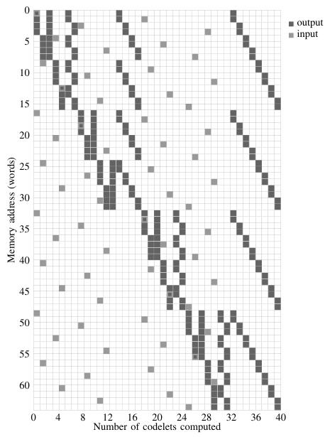

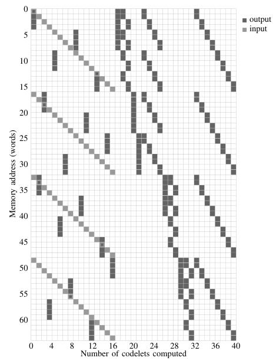


(a) Standard depth-first recursive implementation, using the algorithm in Figure 1.


(b) Modified implementation, using the algorithm in Figure 2. In the first 16 columns, the base cases are computed iteratively in an order that optimizes spatial locality, and the remainder of the transform is computed recursively.

Fig. 4. Memory access patterns of a size 64 decimation-in-time conjugate-pair FFT operating out-of-place. The 64 rows each correspond to a memory address in either the input or the output array. The arrays have been aliased to conserve space, and access to either array is distinguished by shade. Each column represents the memory accesses of a codelet, starting with the first codelet in the leftmost column, and as time advances, more codelets are computed, moving right along the horizontal axis.

Lines 10 and 11 of Figure 1, and so they can be recombined into a codelet that is the same size as the other base case.

The codelet in the first loop of base cases at line 19 of Figure 2 implements a standard N = 2 base case, while the second loop at line 24 implements two N = 1 base case in parallel. The third loop implements N = 2 base cases, but with a permutation due to the conjugate-pair index rotation [34].

Figure 4a shows the memory access pattern of a standard size 64 depth-first recursive implementation of the conjugate-pair FFT, while Figure 4b depicts the memory access pattern of the new algorithm computing the same transform.

The memory access patterns have 64 rows, each corresponding to an address in either the input or the output array. Each column represents the memory accesses of one codelet, starting with the first codelet in the leftmost column. As time goes on, more codelets are computed, moving right along the horizontal axis. In order to conserve space in the figures, the input and output data arrays have been aliased and access to either array is distinguished by shade, and both of the memory access patterns depict implementations with size 4 base cases and vectorized main codelets.

As can be seen from the figures, the new algorithm improves spatial locality and avoids the decimated access to the input data that places a standard implementation.

Each base case codelet writes a sequential block of data to the output array, and the offset for the output of each codelet is precomputed and stored in δ<sub>k</sub>. Recursive code for initializing δ<sub>k</sub> is given in Figure 3, where N is the size of the transform and N<sub>l</sub> is the size of the base cases. O<sub>i</sub> denotes input array offset, O<sub>o</sub> output array offset, S stride, and E even.

In line 18, a sequence of input and output offset pairs are elaborated in the standard depth-first post-order traversal. The conjugate-pair algorithm rotates some indices such that x<sub>−1</sub> = x<sub>N−1</sub>, and these indices are adjusted in lines 19–23 before the sequence is sorted by input offset in line 24. Finally, because the input offsets are now ordered from 0, ..., N/N<sub>l</sub> − 1, they can be implicitly determined from the position in the sequence, and thus the input offsets are discarded in lines 25–27 before returning the sequence of output offsets.

In line 8 of Figure 3, the recursion for the second N/4 subtransform is prevented if the subtransform is a base case, because the second base case will be computed in parallel with the first base case at line 7.

## V. IMPLEMENTATION DETAILS

FFTS uses pregenerated straight-line blocks of code for computing transforms where N ≤ 16, and as with most other implementations, trigonometric coefficients are precomputed.

Because implementations of SSE, AVX and NEON have 16 vector registers, a size-8 subtransform is the largest that can

## Source Image: image-06.png

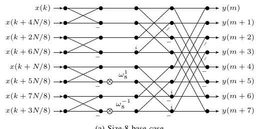

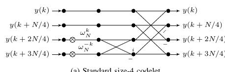

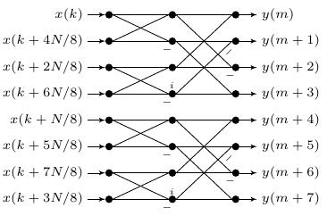

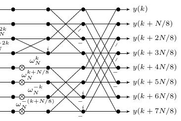


(a) Size-8 base case

Fig. 5. Signal-flow graphs of base case codelets.

(a) Standard size-4 codelet

(b) Pair of size-4 base cases in parallel

(b) Size-8 codelet composed of three size-4 codelets
be easily computed without spilling registers onto the stack. Thus FFTS uses size-8 base cases, as shown above. The signalflow graph for the size-8 base case is shown in Figure 5a, and the signal-flow graph for two size-4 base cases computed in parallel is shown in Figure 5b. For the same reasons, the size of the main codelets is increased to size 8 , where possible, by subsuming three size- 4 codelets into a size- 8 codelet, as shown in Figure 6b. The residual codelets that cannot be subsumed into a size- 8 codelet are computed using the ordinary size- 4 codelet shown in Figure 6a.

The loop of main codelets at line 9 of Figure 2 is trivial to vectorize, but vectorization of the base case loops poses a subtle challenge: two of the loops will have an odd number of iterations. FFTS deals with this problem by automatically generating special codelets to compute the final iteration(s) of one loop in parallel with the first iteration(s) of the next loop (exactly how many iterations from each loop depends on the vector length in the underlying SIMD implementation). The automatic generation of these special codelets is described in [34].

The signal-flow graphs in the above figures are mapped to assembly code fairly directly. For example, the size- 4 codelet in Figure 6a is implemented for ARM NEON with the assembly code in Figure 7.

There are, however, the following differences between the codelets in the SSE and NEON implementations.

- On NEON, vector scatter/gather instructions are utilized to load complex data stored in interleaved format and store the intermediate results in split format, before finally converting back to interleaved format in the final pass. On

SSE, however, exploratory experiments suggested that it was more efficient to use interleaved format for the entire transform, probably because of the separate shuffle pipe in most SSE implementations.

- The SSE codelets were implemented in C with intrinsics, and were further optimized by hand after compilation. The NEON codelets were entirely hand coded in assembly because there are no intrinsics for instructions such as VSWP. The largest codelet is a size- 8 subtransform, and thus small enough that hand optimization is practical.
- The x86 ISA allows the displacement of a memory operation to be encoded as an immediate in the instruction, and so the SSE implementation modifies the displacement at runtime, reducing the number of pointers from eight to one for a size- 8 codelet.
- In the NEON implementation, the sign of the trigonometric coefficients is implicitly absorbed into the computation, and thus the data and the instructions for an inverse transform are different. However, rather than assemble and link two variants of each codelet, an inverse codelet is obtained from a forwards codelet at runtime using the method described in Section VI. In the SSE implementation, the sign is stored as data and the code for a forward and an inverse transform is the same. Again, this difference is probably attributable to the the separate shuffle pipe in most SSE implementations.


## VI. RUN-TIME SPECIALIZATION

To describe the generation of specialized functions, we first define some notation. If $\mathcal{f}$ is a function, then $\llbracket f \rrbracket$ denotes its

## Source Image: image-07.png

```
vld1.32 (q8,q9), [r0, :128]
add r4, r0, r1, lsl #1
vld1.32 (q10,q11), [r4, :128]
add r5, r0, r1, lsl #2
vld1.32 (q12,q13), [r5, :128]
add r6, r4, r1, lsl #2
vld1.32 (q14,q15), [r6, :128]
vld1.32 (q2,q3), [r2, :128]
vmul.f32 q0, q13, q3
vmul.f32 q5, q12, q2
vmul.f32 q1, q14, q2
vmul.f32 q4, q14, q3
vmul.f32 q14, q12, q3
vmul.f32 q13, q13, q2
vmul.f32 q12, q15, q3
vmul.f32 q2, q15, q2
vsub.f32 q0, q5, q0
vadd.f32 q13, q13, q14
vadd.f32 q12, q12, q1
vsub.f32 q1, q2, q4
vadd.f32 q15, q0, q12
vsub.f32 q12, q0, q12
vadd.f32 q14, q13, q1
vsub.f32 q13, q13, q1
vadd.f32 q0, q8, q15
vadd.f32 q1, q9, q14
vadd.f32 q2, q10, q13 @ Change to sub for IFFT
vsub.f32 q4, q8, q15
vsub.f32 q3, q11, q12 @ Change to add for IFFT
vst1.32 (q0,q1), [r0, :128]
vsub.f32 q5, q9, q14
vsub.f32 q6, q10, q13 @ Change to add for IFFT
vadd.f32 q7, q11, q12 @ Change to sub for IFFT
vst1.32 (q2,q3), [r4, :128]
vst1.32 (q4,q5), [r5, :128]
vst1.32 (q6,q7), [r6, :128]
bx lr
```

Fig. 7. ARM NEON code for the size-4 codelet in Figure 6a. In terms of lines of code, the other size-8 codelets are about three times larger, but still small enough that hand optimization is practical.
meaning, usually an input/output function. Thus for $n \geq 0$,

$$
\text { output }=\llbracket \mathrm{f} \rrbracket\left[\mathrm{in}_{0}, \mathrm{in}_{1}, \ldots, \mathrm{in}_{\mathrm{n}-1}\right]
$$

results from running f on input values $\mathrm{in}_{0}, \mathrm{in}_{1}, \ldots, \mathrm{in}_{\mathrm{n}-1}$, and output is undefined if f enters an infinite loop [42].

A function that computes an FFT, given parameters $N$, sign and $x_{n}$, is described by

$$
y_{k=0, \ldots, N-1}=\llbracket \mathrm{fft} \rrbracket\left[N, \operatorname{sign}, x_{n=0, \ldots, N-1}\right]
$$

Suppose now that the parameters $N$ and sign are known at initialization time, and the transform will be computed many times on different data. Specialization is applied by performing the calculations that depend on $N$ and sign during initialization, and generating code to compute the remainder of the calculations, which depend on $x_{n}$. In this case, computation is performed in two stages, described by

$$
\begin{aligned}
& \text { fft }_{N, \text { sign }}=\llbracket \operatorname{genfft} \rrbracket[N, \text { sign }] \\
& y_{k=0, \ldots, N-1}=\llbracket \mathrm{fft}_{N, \text { sign }} \rrbracket\left[x_{n=0, \ldots, N-1}\right]
\end{aligned}
$$

where $\mathrm{fft}_{N, \text { sign }}$ is a specialized function with fixed parameters $N$ and sign. Combining these two yields an equational definition of genfft:

$$
\llbracket \mathrm{fft} \rrbracket\left[N, \operatorname{sign}, x_{n}\right]=\underbrace{\llbracket \llbracket \operatorname{genfft} \rrbracket}_{\text {specialized program }} \llbracket\left[x_{n}\right]
$$

where if one side of the equation is defined, the other is also defined and has the same value [42].

```
push (r4, r5, r6, r7, r8, r9, r10, r11, lr)
vstmdb sp!, (d8-d15)
    add r3, r1, #0
    add r7, r1, #128
    add r5, r1, #256
    add r10, r7, #256
    add r4, r5, #256
    add r8, r10, #256
    add r6, r4, #256
    add r9, r8, #256
    ldr r12, [r0]
    add r1, r0, #0
    add r0, r2, #0
    ldr r2, [r1, #128]
    mov r11, #3
@ << inlined loop of leaf butterfly codelets >>
@ << inlined loop of leaf butterfly pair codelets >>
@ << inlined loop of leaf butterfly codelets >>
ldr r2, [r1, #32]
mov r1, #32
    add r2, r2, #32
    bl neon_x4
    add r0, r0, #256
    sub r1, r1, #16
sub r2, r2, #32
bl neon_x8
    add r0, r0, #128
bl neon_x8
    add r0, r0, #128
    add r1, r1, #16
    add r2, r2, #32
    bl neon_x4
    add r0, r0, #256
    bl neon_x4
@ << inlined final loop of neon_x8 >>
vldmia sp!, (d8-d15)
pop (r4, r5, r6, r7, r8, r9, r10, r11, pc)
```

Fig. 8. Generated ARM code for $N=128$ transform.

The genfft function operates in three stages:

1) The parameters $N$ and sign are used to precompute the trigonometric coefficients;
2) If $N \geq 32$ the output offsets are precomputed using the functions in Figure 2;
3) If $N \geq 32$ specialized machine code is generated, otherwise a pointer to a hard-coded transform is returned.
The code in Figure 8 is generated when initializing a transform for $N=128$ on ARM, and all generated code is of this form, even on x86. Before generating the main function in Figure 8, the codelets for neon_x4 and neon_x8 are copied into place and modified. As previously mentioned, computation of an inverse transform on ARM requires that some instructions be adjusted.

The stack is only used for saving and restoring registers in the prologue and epilogue, corresponding to lines 1, 2, 42 and 43 in Figure 8. Following the prologue, pointers and parameters for the first three loops are setup in lines 3-15, and the three loops are inlined in lines 17-21. In the SSE implementation, only one pointer is used for the base case codelets, and offsets are encoded into the immediate field of the instructions at runtime. Next, the depth-first recursive structure of the non-terminal parts of the transform are elaborated, and for each subtransform a call is emitted, resulting in lines 23-38 of Figure 8. The final non-terminal function is inlined.

## Source Image: image-08.png

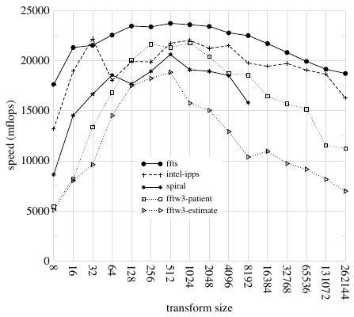

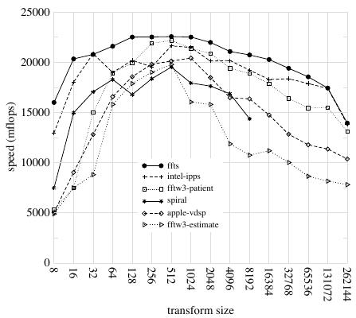

## VII. RESULTS

FFTS has been evaluated against other state-of-the-art libraries on recent Intel x86 and ARM machines. The benchmark methods are described in Section VII-A, and speed, initialization time and accuracy results are presented in the following three subsections. Data relating to code size is presented in Section VII-E.

The scope of this work has been limited to single-precision, single-threaded, 1D transforms on power-of-two sizes of inputs, and the benchmarks on Intel x86 machines have been computed with SSE, even when AVX is available (later versions of FFTS will support AVX).

## A. Benchmark Methods

The benchmarks were performed with BenchFFT [44], a collection of libraries and benchmarking software assembled by Frigo and Johnson, the authors of FFTW.

The benchmarks measure speed, initialization time and accuracy. Initialization and run time of an FFT are measured separately. The former is measured once, while the latter is measured more accurately by executing several runs and choosing the minimum time, where each run consists of a large number of FFTs.

The minimum time for a transform is then used to calculate a scaled inverse time measurement based on the asymptotic number of floating-point operations required for computing the radix-2 Cooley-Tukey algorithm. This measurement is sometimes referred to as Cooley-Tukey equivalent GigaFLOPS (CTGs), but in this work MFLOPS is used, which are defined for a transform of size $N$ as $\left(5 N \log _{2} N\right) / t$, where $t$ is the time in microseconds for one transform, excluding initialization time [2]. In this case the measurement is not an actual FLOP count, but rather a rough measure of a particular implementation's efficiency relative to the radix-2 algorithm and the clock speed of the machine.

To measure the accuracy of a transform, the output is compared with an arbitrary-precision FFT computed on the same inputs, and relative RMS error is plotted. The inputs are pseudo-random in the range $[0.5,0.5)$ and the arbitraryprecision FFT has over 40 decimal places of accuracy. When a transform has several variants, such as direction or radix, the accuracy is reported as being the worst of the results.

## B. Speed

Figure 9 shows the speed of benchmarks run on a 3.8 GHz Intel "Sandy-bridge" Core i7-2600 running Linux. Figure 10 plots the results of benchmarks on a MacBook Pro 10,1 running OS X 10.8.1, equipped with a 3.3 GHz Intel "Ivy-bridge" Core i7-3615QM. Figure 11 plots the results of benchmarks run on 3.4 GHz Intel "Sandy-bridge" Core i5-2400 running Linux. All code in the above benchmarks was compiled with the latest available release of the Intel compilers.

In addition to Intel x86 machines, two ARM machines running iOS were benchmarked. Figure 12 shows the results of benchmarks run on an Apple A4 System-on-Chip (SoC), which implements the ARM Cortex-A8 core running at 1 GHz .


Fig. 9. Speed of single-precision power-of-two FFTs running on an Intel Core i7-2600 CPU with 8 MB of cache running at 3.8 GHz . Compiler: icc 12.1.5


Fig. 10. Speed of single-precision power-of-two FFTs running on an Intel Core i7-3615QM CPU with 6 MB of cache running at 3.3 GHz . Compiler: icc 12.1.5

Figure 13 plots the results of benchmarks run on an Apple A5 SoC, which implements the ARM Cortex-A9 core running at 1 GHz . All code in the ARM benchmarks was compiled with Apple clang 4.0.

The performance of all implementations drops for large transforms, illustrating the effects of the cache hierarchy.

There are some instances where FFTS is slower than other libraries. In many cases the 32-point transform is slower than Intel IPP, and on the Apple A5 the 8 and 16-point transforms are slower than FFTW. Because the smaller transforms are not widely used, they have not yet been highly optimized in FFTS. For $N<32$, FFTS only uses scalar arithmetic, and for $N=32$, and direct implementation would likely be faster (at the cost of code size). Furthermore, in [34] it was shown that the ordinary split-radix algorithm is marginally faster when the data fits in cache (very approximately, where $N<16384$ or so for most machines), and this would likely result in FFTS being faster than FFTW running in patient mode for the size

## Source Image: image-09.png

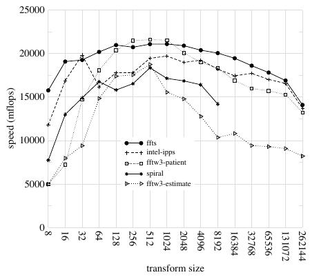

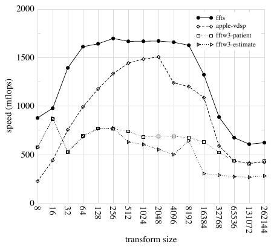

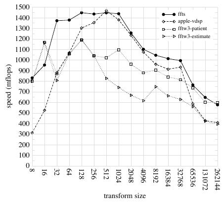

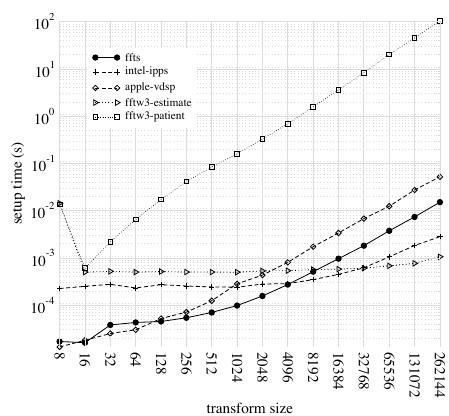


Fig. 11. Speed of single-precision power-of-two FFTs running on an Intel Core i5-2400 CPU with 6 MB of cache running at 3.4 GHz . Compiler: icc 12.1.5


Fig. 12. Speed of single-precision power-of-two FFTs running on an Apple A4 SoC, which uses an ARM Cortex A8 with 512 kB of cache, and clocked at 1 GHz . Compiler: Apple clang 4.0

256, 512 and 1024 transforms in Figure 11.

## C. Initialization Time

Figure 14 shows the initialization times for codes running on a MacBook Pro 10,1 with an Intel i7-3615QM. On this machine, all libraries initialize within one second, with the exception of FFTW running in patient mode, which begins to take more than one second for transforms larger than 4096.

Graphs for other machines are similar.

## D. Accuracy

Figure 15 shows the accuracy of codes running on a MacBook Pro 10,1. The accuracy of all codes is within an acceptable range for single-precision arithmetic, and graphs for other machines are similar.


Fig. 13. Speed of single-precision power-of-two FFTs running on an Apple A5 SoC, which uses an ARM Cortex A9 with 1 MiB of cache, and clocked at 1 GHz . Compiler: Apple clang 4.0


Fig. 14. Setup time of single-precision power-of-two FFTs running on an Intel Core i7-3615QM CPU running at 3.3 GHz . Compiler: icc 12.5

TABLE I
CODE SIZE FOR A STATICALLY LINKED TEST PROGRAM.

| Name of FFT library | Size (kilobytes) |
| :-- | --: |
| FFTS | $\mathbf{3 3 . 2 8}$ |
| Intel IPP | 510.70 |
| FFTW3 | 1733.16 |

## E. Code Size

Table I shows the size of a test program when statically linked with different FFT libraries, on OS X 10.8.1 with the Intel compilers. The test program computes a DFT, and does little else. Because FFTS dynamically generates code, the binary is small, however it should be noted that FFTS currently only computes a subset of the transforms supported by FFTW.

The size of the dynamically generated code varies according

## Source Image: image-10.png

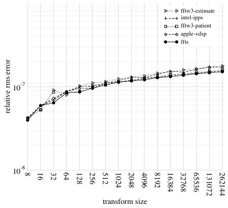

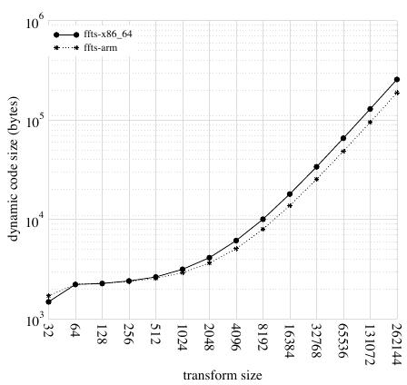


Fig. 15. Accuracy of single-precision power-of-two FFTs running on an Intel Core i7-3615QM CPU running at 3.3GHz. Compiler: icc 12.5


Fig. 16. Dynamic code size on ARM and x86-64.

to the size of the transform and the underlying machine, as shown in Figure 16.

## VIII. CONCLUSION AND FUTURE WORK

This paper described FFTS, a DFT library which implements a new cache-oblivious FFT algorithm with runtime specialization. When evaluated with benchmarks run on recent Intel x86 and ARM machines, FFTS was faster than self-tuning libraries and even vendor tuned libraries in almost all cases, without requiring any machine-specific calibration or hardware parameters (due to the use of a cache oblivious algorithm) or an extensive library of codelets.

Program specialization is not a new technique, and has already been applied to the FFT in various different forms [3], [45]. However, FFTS is unique in that it takes specialization to the limit by generating specialized machine code at runtime rather than statically generating or interpreting specialized code.

Future work will apply these techniques to multi-threaded and multi-dimensional transforms, and add support for non-power-of-two sizes. Multi-dimensional transforms have already been implemented, but as there are special considerations for such transforms, that work falls outside the scope of this paper. Support for AVX and AVX2 will also be implemented in future.

FFTS has been released as open source code under a permissive license, and runs on Linux, OS X and iOS, on the Intel x86 and ARM architectures. Support for other architectures and operating systems will be added in the future.

## ACKNOWLEDGMENT

We are grateful to Associate Professor J.A. Perrone for the many helpful discussions relating to this work, which was partly supported by a Marsden grant awarded to him by the Royal Society of New Zealand.

## REFERENCES

- [1] S. Kleene, N. de Bruijn, J. de Groot, and A. Zaanen, "Introduction to metam Mathematics," 1952.
- [2] M. Frigo and S. Johnson, "The design and implementation of FFTW3," *Proceedings of the IEEE*, vol. 93, no. 2, pp. 216–231, 2005.
- [3] S. G. Johnson and M. Frigo, "Implementing FFTs in practice," in *Fast Fourier Transforms*, ser. Connexions, C. S. Burrus, Ed. Houston TX: Rice University, September 2008, ch. 11.
- [4] M. Frigo and S. Johnson, "FFTW: An adaptive software architecture for the FFT," in *Acoustics, Speech and Signal Processing, 1998. Proceedings of the 1998 IEEE International Conference on*, vol. 3. IEEE, 1998, pp. 1381–1384.
- [5] S. Johnson and M. Frigo, "A modified split-radix FFT with fewer arithmetic operations," *Signal Processing, IEEE Transactions on*, vol. 55, no. 1, pp. 111–119, 2006.
- [6] M. Frigo, "A fast Fourier transform compiler," in *ACM SIGPLAN Notices*, vol. 34, no. 5. ACM, 1999, pp. 169–180.
- [7] A. Ali and L. Johnsson, "UHFFT: A high performance DFT framework," 2006.
- [8] A. Ali, L. Johnsson, and J. Subhlok, "Scheduling FFT computation on SMP and multicore systems," in *Proceedings of the 21st annual international conference on Supercomputing*. ACM, 2007, pp. 293–301.
- [9] A. Ali, L. Johnsson, and D. Mirkovic, "Empirical auto-tuning code generator for FFT and trignometric transforms," in *ODES: 5th Workshop on Optimizations for DSP and Embedded Systems, in conjunction with International Symposium on Code Generation and Optimization (CGO)*, 2007.
- [10] D. Mirkovic and L. Johnsson, "Automatic performance tuning in the UHFFT library," *Lecture notes in computer science*, pp. I–71, 2001.
- [11] D. Mirkovic, R. Mahasoom, and L. Johnsson, "Adaptive software library for fast Fourier transforms," in *2000 International Conference on Supercomputing*, 2000, pp. 215–224.
- [12] A. Ali, L. Johnsson, and J. Subhlok, "Adaptive computation of self sorting in-place FFTs on hierarchical memory architectures," *High Performance Computing and Communications*, pp. 372–383, 2007.
- [13] J. Cooley and J. Tukey, "An Algorithm for the Machine Calculation of Complex Fourier Series," *Mathematics of Computation*, vol. 19, no. 90, pp. 297–301, 1965.
- [14] P. Duhamel and H. Hollmann, "Split radix FFT algorithm," *Electronics Letters*, vol. 20, no. 1, pp. 14–16, 1984.
- [15] R. Yavne, "An economical method for calculating the discrete Fourier transform," in *Proceedings of the December 9-11, 1968, fall joint computer conference, part I*. ACM, 1968, pp. 115–125.
- [16] I. Kamar and Y. Elcherif, "Conjugate pair fast Fourier transform," *Electronics Letters*, vol. 25, p. 324, 1989.
- [17] C. Rader, "Discrete Fourier transforms when the number of data samples is prime," *Proceedings of the IEEE*, vol. 56, no. 6, pp. 1107–1108, 1968.

<sup>1</sup>Available at http://www.cs.waikato.ac.nz/~ablake/ffts

